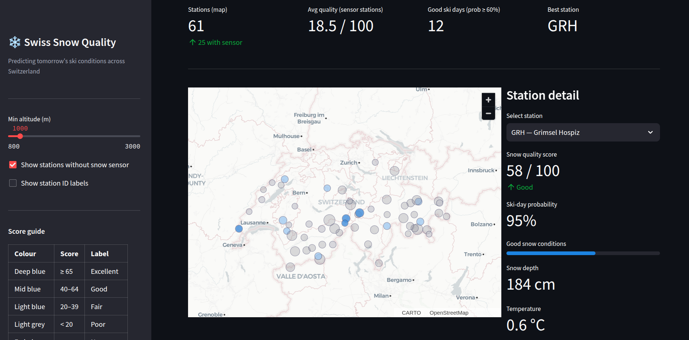

# Swiss Snow Quality Predictor

End-to-end ML system predicting **next-day snow quality** (0–100 score) and **good ski day probability** for 75 Swiss alpine stations. Powered by 16 years of official MeteoSwiss telemetry and served via a live interactive map.

**Models** — trained on 49K station-days, validated on held-out 2023–2025 data:

| Model | Task | MAE | R² | AUC-ROC | Avg Precision |
|---|---|---|---|---|---|
| `snow_quality_regressor` | Regression | **4.5 / 100** | **0.877** | — | — |
| `good_ski_day_classifier` | Binary | — | — | **0.986** | **0.962** |

---

## How It Works

```
MeteoSwiss OGD (75 stations, no key required)
        │
        ▼
Feature Pipeline — 28 features: rolling temps, snow depth lags,
        │          freshness decay, warm-rain conditioning, seasonal encoding
        ▼
XGBoost models (t → t+1 targets, time-based train/val split)
        │
        ├──► Hopsworks Model Registry  ──► Streamlit map (HF Spaces)
        └──► MLflow experiment log
```

**Every Monday**, GitHub Actions fetches fresh MeteoSwiss data, retrains both models, pushes new versions to the Hopsworks Model Registry, and restarts the live Space.

---

## ML Design Decisions

**Label leakage fix** — a naive same-day target gives R² 0.998/AUC 1.0 (too good to be true). All targets are shifted to t+1: features describe today, labels describe tomorrow.

**Snow quality score (0–100)** — additive composite with six components:
- Depth score (0–65 pts): sqrt-scaled, 250 cm ceiling
- Temperature score (−10 to +12 pts): cold bonus, warm penalty
- Freshness score (0–15 pts): exponential decay, half-life ≈ 3.5 days
- Accumulation bonus (0–5 pts): rewards active snowfall events
- Warm-rain penalty (−15 to 0 pts): only penalises precipitation when temp > 1 °C — cold heavy precip is snowfall, not a penalty
- Cold+sunny bonus (0–3 pts): bright powder days at altitude

**Class imbalance** — good ski day classifier uses `scale_pos_weight = neg/pos` (≈ 1.75×) rather than resampling, preserving the true class distribution in evaluation.

---

## Project Structure

```
swiss_snow/
├── src/
│   ├── data/
│   │   ├── fetch_meteoswiss.py     # MeteoSwiss OGD fetcher (historical + recent)
│   │   └── fetch_openmeteo.py      # OpenMeteo forecast + ERA5 fetcher
│   ├── features/
│   │   └── build_features.py       # Feature pipeline, target computation, Hopsworks push
│   ├── models/
│   │   └── train.py                # XGBoost training, MLflow logging, Hopsworks push
│   ├── api/
│   │   └── app.py                  # FastAPI serving endpoint
│   └── monitoring/
│       └── drift_report.py         # Evidently drift reports (HTML + JSON)
├── pipelines/
│   └── weekly_retrain.py           # Prefect 3 flow (local orchestration)
├── models/
│   ├── snow_quality_regressor.json  # Committed fallback (3 MB)
│   └── good_ski_day_classifier.json
├── .github/workflows/
│   ├── ci.yml                      # Lint (ruff) + smoke tests on every push
│   └── retrain.yml                 # Weekly cron: fetch → features → retrain → deploy
├── app.py                          # Streamlit + PyDeck interactive map
├── hopsworks_utils.py              # Feature Store + Model Registry helpers
├── Dockerfile
├── docker-compose.yml
└── requirements.txt
```

---

## Running Locally

```bash
pip install -r requirements.txt

# Fetch data
python src/data/fetch_meteoswiss.py recent      # last ~54 days
python src/data/fetch_meteoswiss.py historical  # full archive (2009–2025)

# Build features
python src/features/build_features.py

# Train
python src/models/train.py
mlflow ui --port 5000   # view experiment results

# Launch map
streamlit run app.py
```

### With Docker

```bash
docker compose up   # API on :8000, Streamlit on :8501
```

### With Hopsworks (optional)

```bash
export HOPSWORKS_API_KEY=your_key   # from app.hopsworks.ai → Settings → API Keys
```

All pipelines activate Hopsworks automatically when the key is present and degrade gracefully without it. Feature groups and model versions are created on first run.

---

## Deployment 

The live app runs on Hugging Face Spaces. On cold start it fetches the latest MeteoSwiss data automatically.

| Component | Provider |
|---|---|
| Interactive map | [Hugging Face Spaces](https://huggingface.co/spaces) (Streamlit SDK) |
| Feature store + model registry | [Hopsworks Serverless](https://app.hopsworks.ai) |
| Weekly retraining | GitHub Actions cron |

**One-time setup:**
```bash
# 1. Create a HF Space (Streamlit SDK) at huggingface.co/spaces
# 2. Add HOPSWORKS_API_KEY as a Space Secret (Settings tab)
git remote add space https://huggingface.co/spaces/<username>/swiss-snow
git push space main
```

**GitHub Actions secrets** (for automated weekly retraining):

| Name | Purpose |
|---|---|
| `HOPSWORKS_API_KEY` | Push retrained models to registry |
| `HF_TOKEN` | Restart the Space after retrain |
| `HF_SPACE` | Space ID: `username/space-name` (Actions variable) |

---

## Tech Stack

| Layer | Tools |
|---|---|
| Data ingestion | MeteoSwiss OGD, OpenMeteo ERA5 |
| Feature engineering | pandas, numpy |
| Modelling | XGBoost, scikit-learn |
| Experiment tracking | MLflow |
| Feature store / model registry | Hopsworks |
| Orchestration (local) | Prefect 3 |
| Drift monitoring | Evidently |
| REST API | FastAPI |
| Frontend | Streamlit, PyDeck |
| Containerisation | Docker, Docker Compose |
| CI / automated retraining | GitHub Actions |
